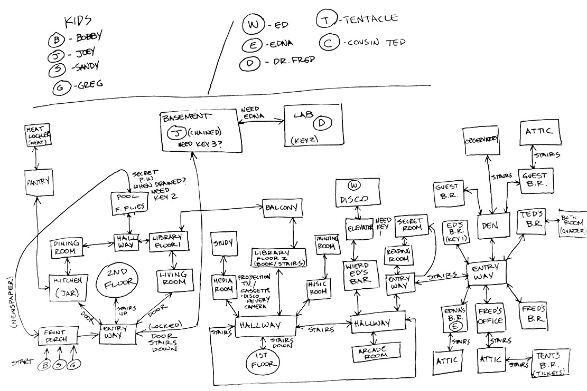
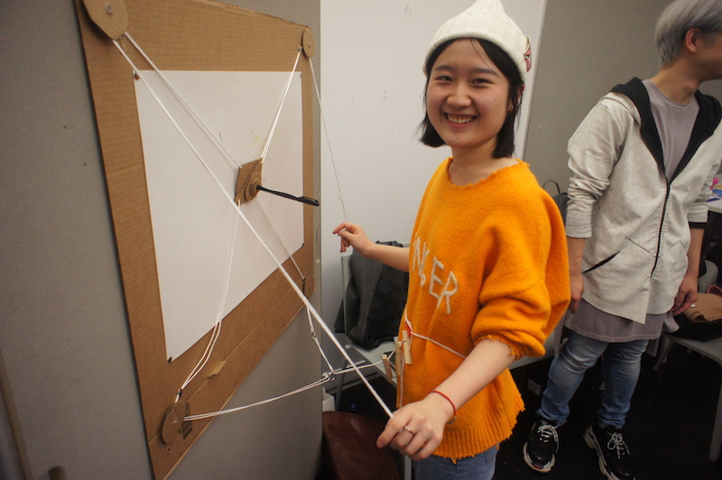
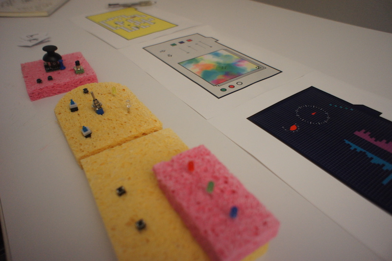
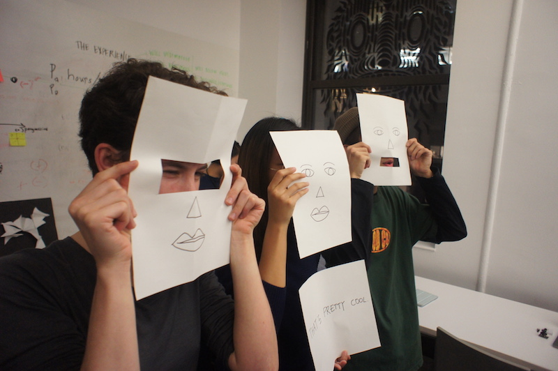
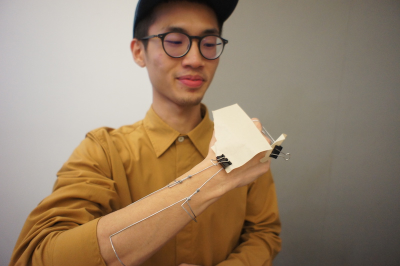
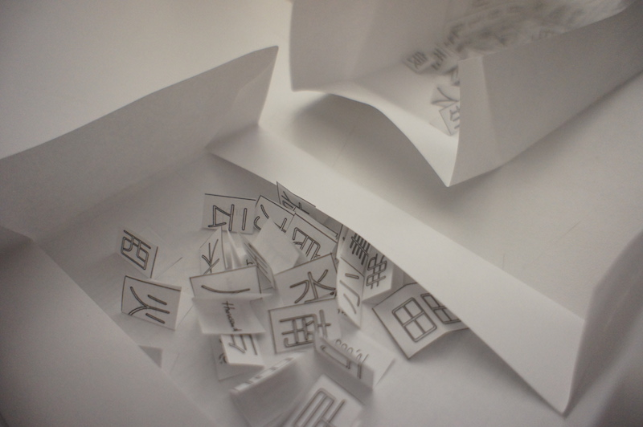
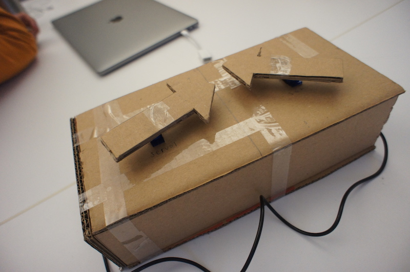
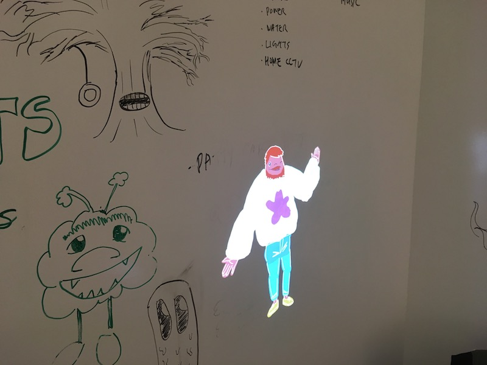
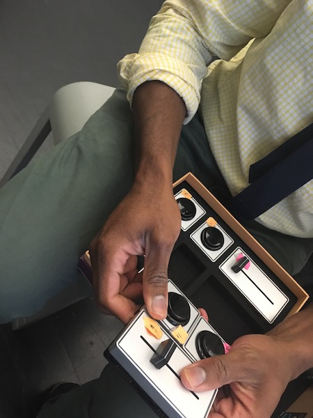
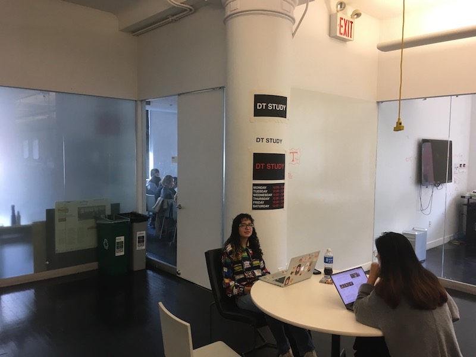

## Ideas in Form Part 4: Interaction Study

The primary goal of your Interaction Study is **explore** an interactive project idea related to your research topic. Remember you are exploring the relationship between form, subject, and purpose, looking for insights and opportunities. This is **research** through **making**.

Ultimately what you make for your Interaction Study is pretty open.

It should demonstrate an idea rooted in interaction.{biggest}

It should be expressed in a physical format.{biggest}

::: .callout

Don't forget to generate written and visual documentation of your process and findings as you go!{biggest}

/::

### Expression vs. Implementation

You don't necessarily need to **implement** an your interactive idea to learn from it. In fact, if you plan on implementing your idea it will likely limit your exploration, because you will avoid ideas you don't know how to fabricate or code.

You do need to **express** your idea. An idea in your head is never as good as it seems. It is full of gaps and conflicts that are hard to see because, an idea in your head is fluid. When you think about one aspect of it the other aspects bend and shift to fit. Look at it another way, and it shifts again. When you **express** and idea in a fixed **form**, it forces you to confront those gaps and conflicts and try to resolve them. 

Sometimes "good" ideas just don't work. {biggest}

Sometimes "dumb" ideas work suprising well. {biggest}


### Fidelity

| Low Fidelity | High Fidelity  |
| ------------ | -------------- |
| cheaper      | more expensive |
| easier       | harder         |
| quicker      | slower         |
| ambiguous    | specific       |
| uncertain    | certain        |
| broad        | detailed       |
| loose        | tight          |
| creative     | demonstrative  |
| flexible     | rigorous       |


### Paper Prototyping

Popular in in UI/UX design, paper prototyping is one approach to low fidelity exploration of interactive ideas.

<div class="image-row">


</div>

### Wizard of Oz Protocol

The Wizard of Oz Protocol is a method of exploring computer interactions without code by having a human perform the computer's role. When using this technique, you should have a clear plan of how your computer/human/system should act: don't just wing it.

<div class = "image-row">




</div>

### Interaction Studies

<div class = "image-row">









<!--  -->


</div>

### See Also

[Adobe: Prototyping 101](https://theblog.adobe.com/prototyping-difference-low-fidelity-high-fidelity-prototypes-use/)

[Paper Prototyping: The 10-Minute Practical Guide](https://www.uxpin.com/studio/blog/paper-prototyping-the-practical-beginners-guide/)


## HTML CSS Layout Introduction

### Learning HTML Layout takes Practice

You can be introduced to the most-important css layout properties in an hour or so, but that isn't nearly enough time to develop the skill of using css to lay out documents. Gaining that skill takes experience and practice.

https://developer.mozilla.org/en-US/docs/Learn/CSS/CSS_layout


### HTML + CSS are Evolving Standards

I have made at least dozens of unique html layouts over 20 years, and making websites still sends me running to Google, MDN, and Stack Overflow. This is partly due to the continual evolution of HTML and CSS. 

- New CSS features are proposed frequently.
- The best practice for achieving particular effects changes as new features are implemented in browsers.
- Web developers frequently use, misuse, and abuse HTML and CSS features to achieve effects not intended by the designers of CSS.


[caniuse.com](https://caniuse.com/)
: Quick reference website shows the state of browser support for specific HTML/CSS/JS features.


### HTML + CSS are Designed for Documents

- HTML layout follows the [normal flow](https://developer.mozilla.org/en-US/docs/Learn/CSS/CSS_layout/Normal_Flow)
- `block` content stacks from top to bottom
- `inline` content wraps from left to right, top to bottom
- explicit horizontal, implicit vertical
- designed for responsive, not fixed, layouts


## CSS Layout Properties


### Display

```css
display: block | inline | none | flex;
```

Overrides element default `block` or `inline` display type.


- overloads *inner* display type and *outer* display type
- values of `inline-block` and `inline-flex` provide a way to combine 
- CSS 3 solves this with support for two keywords (1 inner, 1 outer) but support is lacking.

[MDN: Display](https://developer.mozilla.org/en-US/docs/Web/CSS/display)


### Position

```css
position: static | relative | absolute | fixed;
```

Controls if the element is positioned in the flow.

| value    | description                                                                |
| -------- | -------------------------------------------------------------------------- |
| static   | position this box in the flow normally                                     |
| relative | position this box in the flow, with offset                                 |
| absolute | pull this item out of the flow, position relative to "positioned" ancestor |
| fixed    | pull this item out of the flow, position relative to the window            |


- Position is also overloaded, controlling both how the element is positioned, and if the element is used for the basis of child positioning.
- These names are confusing.
- Fixed is often used to create a locked top nav
- Fixed promotes locked layouts. Avoid it until you are comfortable creating flowing, responsive documents.
  
[MDN: Position](https://developer.mozilla.org/en-US/docs/Web/CSS/position)
  


### Box Sizing + The Box Model

```css
box-sizing: border-box | content-box;
width: 100px;
height: 100px;
```

`width` and `height` control the size of a box. `box-sizing` controls the meaning of `width` and `height`.

- Box Size Properties: `width`, `height`, `max-width`, `max-height`, `min-width`, `min-height`
- Box Size Units: `px`, `em`, `%`

<div style="width: 50%;">


</div>

[MDN: Box Model](https://developer.mozilla.org/en-US/docs/Web/CSS/CSS_Box_Model/Introduction_to_the_CSS_box_model)

[MDN: box-sizing](https://developer.mozilla.org/en-US/docs/Web/CSS/box-sizing)


### Margin

```css
margin: 10px auto;
margin-top: 2em;
margin-left: 1px;
```

Controlls the space around/between blocks.

- Margins [collapse](https://developer.mozilla.org/en-US/docs/Web/CSS/CSS_Box_Model/Mastering_margin_collapsing)
- margin `auto` can be used for centering


[MDN: Box Sizing](https://developer.mozilla.org/en-US/docs/Web/CSS/box-sizing)


### Float + Clear

Floats were intended for allowing text to "run around" images and other blocks. They are also often used for creating column layout. Floats can be quirky, I prefer using flexbox now that it is widely available.

[MDN: Floats](https://developer.mozilla.org/en-US/docs/Learn/CSS/CSS_layout/Floats)

### Inline Block

`display: inline-block` can be used sort of like floats for creating column layouts, but has its own quirks. Again, I prefer using flexbox now.

### Flexbox

```css
display: flex;
flex-direction: row;
flex-wrap: wrap;
justify-content: flex-start;
align-content: flex-start;
align-items: flex-start;

flex-grow: 1;
flex-shrink: 1;
flex-basis: 100px;
```


The Good:
- flexible layout system, useful for many effects
- less quirks and side effects
- allows combining multiple properties on multiple elements to achieve different effects


The Bad:
- naming is confusing
- requires combining multiple properties on multiple elements to achieve different effects


[MDN: Basic concepts of Flexbox](https://developer.mozilla.org/en-US/docs/Web/CSS/CSS_Flexible_Box_Layout/Basic_Concepts_of_Flexbox)


### Media Queries

Media Queries allow you to apply different CSS rulesets depending on the size of the browser window/screen. This can be used to make high-level layout changes between desktop and mobile.
[MDN: Using Media Queries](https://developer.mozilla.org/en-US/docs/Web/CSS/Media_Queries/Using_media_queries)


## Planning a Layout

- higher-order design: designing the system that determines the layout vs. designing the layout
- thumbnail layout options in pencil on paper
- draw out the layout you want a little larger layout and break it up into nested boxes
- stacks of boxes (rows) can be done with the regular block flow
- columns can be done with flexbox
  


## Resources
[learnlayout.com](http://learnlayout.com/)

[CSS Tricks: Flexbox](https://css-tricks.com/snippets/css/a-guide-to-flexbox/)

[Flexbox in 5](https://cvan.io/flexboxin5/)


<style>

.image-row p {
    
    flex-wrap: wrap;
    display: flex;
    
}

.image-row img {
    
    height: 300px;
    margin: 0;
}
</style>