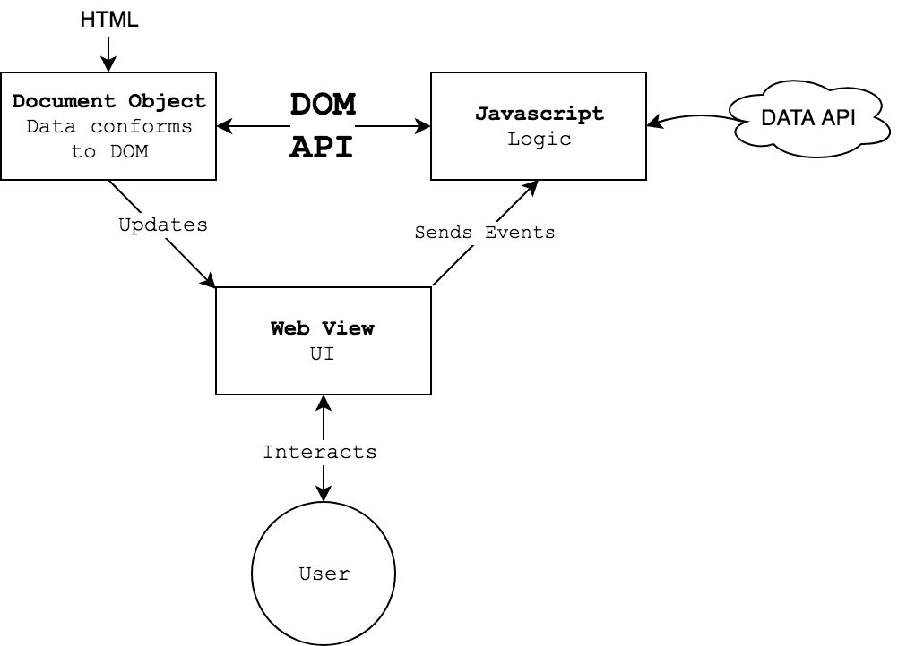

## October 18 {plain}


| Time  | ESA      | Type           | Activity                       |
| ----- | -------- | -------------- | ------------------------------ |
| 12:10 | Engage   | Activity       | Test Today's App               |
| 12:20 | Study    | Lecture        | Data-Driven Web Pages with REST  |
| 12:40 | Activate | Code Challenge | Building a Static Page         |
| 1:00  | Activate | Code Challenge | Adding Content with Javascript |
| 1:20  | Break    | Break          | Break                          |
| 1:30  | Activate | Code Challenge | Loading Data with Javascript   |
| 2:00  | Activate | Code Challenge | Displaying Data with Content   |


## Today We Make This

Today we will build this simple, data-driven web page that pulls data submitted by a google form.

[The Web Page](../examples/rest/4_sheet.html){bigger}

[The Google Form](https://goo.gl/forms/IodqYKkWCRmM2ouq1){bigger}

[The Published Google Sheet](https://docs.google.com/spreadsheets/d/e/2PACX-1vRiMkEVoeGJHQaHHDxy5jttwckmoxC14AOdWHhNxEB9aNq98C6KFhY8K97PUbI6AYeu8bQbClgjKXUZ/pubhtml){bigger}

[The Published Google Sheet in JSON](https://spreadsheets.google.com/feeds/list/1e5lwamCY3ieZ7vWm6n9hn0UfYvjZrSBOtMWtwd5MwKw/default/public/values?alt=json){bigger}

[The Editable Google Sheet](https://docs.google.com/spreadsheets/d/1e5lwamCY3ieZ7vWm6n9hn0UfYvjZrSBOtMWtwd5MwKw/edit#gid=1453659823){bigger}

<br/>
<br/>

Note that the sheet published but not shared publicly. You need to be shared on the document to edit it in the sheets application.

### Basic Computer Games

Reading code is a good way to learn to write code.


[Archive of Basic Computer Games](https://www.atariarchives.org/basicgames/)


## Data-Driven Web Pages




Page rendering process:
1. Browser loads HTML
2. Browser parses HTML and creates Document Object
3. Web View renders Document Object
4. Browser loads and runs Javascript
5. Javascript requests JSON Data using the Google Sheets REST API
6. Javascript parses JSON and updates Document Object
7. Web View updates to reflect updated Document Object

### REST APIs

::: .callout
Google Sheets provides a very simple way to get the data of a published sheet as JSON, so we don't need a full API for this simple demo. That said, its a good idea to know a little about REST APIs.
/::


REST API's are a popular way for web-based services to provide information to client applications. 

For details on REST, this is a good place to start: [Codecademy: What is REST?](https://www.codecademy.com/articles/what-is-rest)

Very briefly, REST APIs allow clients to request resources from servers. REST is a general architecture: each API will have its own request and resources formats. Its also good to know that REST is stateless: each request is independent, it doesn't matter what requests happened previously.

A client makes a request to retrieve or modify a resource using HTTP:

```json
// GET
https://jsonplaceholder.typicode.com/todos/1
```

And the server responds wit the result of the request:

```json
{
  "userId": 1,
  "id": 1,
  "title": "delectus aut autem",
  "completed": false
}
```

This response is in JSON. Not all REST APIs use JSON, but many do. The format of requests and responses is defined by each individual API.

There are many, many API's that use REST.

[Free Public APIs List](https://github.com/toddmotto/public-apis)

[Any API](https://any-api.com/)


### Authentication + Authorization

**Authentication** Are you really you?

**Authorization** Are you allowed to do this?

Some REST API's don't require Authentication at all, but others do. There are a number of ways Authentication and Authorization can be handled in a REST API. If the API you want to use requires Authentication + Authorization you'll need to read its documentation to learn how to Authenticate.

[RESTful API Authentication Basics](https://blog.restcase.com/restful-api-authentication-basics/)


### Exploring APIs wit the Command Line

Sometimes it can be handy to interact with a REST resource directly, using the CLI.

These examples use `curl` a widely-available CLI app for transferring data to and from a server.

The data is provided by [JSONPlaceholder](https://jsonplaceholder.typicode.com/), a dummy REST API for demos and tests.

```
curl https://jsonplaceholder.typicode.com/todos/1
curl https://jsonplaceholder.typicode.com/todos
curl https://jsonplaceholder.typicode.com/comments?postId=1
```

You can use the pipe `|` to send the output of curl to VS Code. This can be a handy trick.

```
curl https://jsonplaceholder.typicode.com/comments?postId=1 | code -
```

There are also a number of GUIs for exploring REST APIs

- [Restlet Client Chrome Extension](https://chrome.google.com/webstore/detail/restlet-client-rest-api-t/aejoelaoggembcahagimdiliamlcdmfm/related)
- [Insomnia App](https://insomnia.rest/)
- [Postman App](https://www.getpostman.com/)


## Challenge 1: Building a Static Page

Practice CSS by styling a simple HTML page to match a target style.

This starting source is incomplete and may contain errors for you to fix!

[Target Style](../examples/rest/1_static.html){bigger}

**Starting HTML**
```html
<!DOCTYPE html>
<html lang="en">
<head>
    <title>Google Sheets REST Demo</title>
    <link rel="stylesheet" href="style.css">
</head>
<body>
    <h1>Systems Lab 2018</h1>
    <ul id="students">
        <li><a href="https://github.com/jbakse">Justin Bakse</a></li>
        <li><a href="https://github.com/jbakse">Testy Testerson</a></li>
        <li><a href="https://github.com/jbakse">Fakey McFake</a></li>
    </ul>
</body>
</html>
```

**Starting CSS**
```css
@import url('https://fonts.googleapis.com/css?family=Quicksand');

html {
    font-family: 'Quicksand', sans-serif;
}

body {
    text-align: center;
    background: #EEE;
}

h1 {
}

#students {
    list-style: none;
}

#students a {
}
```


## Challenge 2: Adding Content with Javascript

Create a `dom.js` file in your project, add this code, and fix the errors.

**Starting JS**
```javascript
console.log('Hello, DOM!');

window.onload = main;

function main() {
  console.log(Hello, main()!);
  const studentList = document.getElementById('student');
  const newLi = document.createElement('li');
  newLi.innerHTML = '<a href="#">Mr. Javascript</a>';
  studentsList.appendChild(newLi);
}
```

Add this `script` tag to your `.html` just before the closing `</body>` tag.

```html
<script src="dom.js"></script>
```


## Loading Data with Javascript

Add this to the end of your javascript file and study it.

```javascript
console.log('Hello, DATA!');

fetch('https://jsonplaceholder.typicode.com/todos/1')
  .then(response => response.json())
  .then(gotJSON);


function gotJSON(json) {
  console.log('Hello, gotJSON()!');
  console.log(json);
  console.log(json.title);
  console.log(`My id is ${json.id}!`);
}
```


## Displaying Data with Javascript


### Publishing a Google Sheet

I set up a Google Form that stores responses in a Google Sheet. You can access the sheet data as a JSON object using this URL Template:

```
https://spreadsheets.google.com/feeds/list/${document_id}/{sheet_id}/public/values?alt=json
```

You'll need the `document_id` which you can find in the url:

Document URL:
```
https://docs.google.com/spreadsheets/d/1e5lwamCY3ieZ7vWm6n9hn0UfYvjZrSBOtMWtwd5MwKw/edit#gid=1453659823
```

Document ID:
```
1e5lwamCY3ieZ7vWm6n9hn0UfYvjZrSBOtMWtwd5MwKw
```

You'll also need the `sheet_id`. If you want the first sheet use `1` or `defualt`

Putting it together you can get a JSON feed of the test sheet at:

```
https://spreadsheets.google.com/feeds/list/1e5lwamCY3ieZ7vWm6n9hn0UfYvjZrSBOtMWtwd5MwKw/default/public/values?alt=json
```

[See the JSON feed in your browser.](https://spreadsheets.google.com/feeds/list/1e5lwamCY3ieZ7vWm6n9hn0UfYvjZrSBOtMWtwd5MwKw/default/public/values?alt=json)

It can be handy to have JSON files formatted in your browser, and you can get extensions to do that for you.
[JSON Formatter](https://chrome.google.com/webstore/detail/json-formatter/bcjindcccaagfpapjjmafapmmgkkhgoa)


### Google Sheets API

The Google Sheets API lets you read and modify Google spreadsheets. It is more complicated than the approach above but much more powerful. 

[Google Sheets API Guide](https://developers.google.com/sheets/api/guides/concepts)


### Putting it Together

Replace your Javascript with this code and study it.

```javascript
console.log('Hello, Sheet!');

// update on dom load
window.onload = requestJSON;

// update every 10 seconds
setInterval(requestJSON, 10000);

// request data from google sheets
function requestJSON() {
  fetch('https://spreadsheets.google.com/feeds/list/1e5lwamCY3ieZ7vWm6n9hn0UfYvjZrSBOtMWtwd5MwKw/default/public/values?alt=json')
    .then(response => response.json())
    .then(gotJSON);
}

// recieve response from google sheets
function gotJSON(json) {
  console.log('Update Data');
  const entries = json.feed.entry;

  // get the list
  const studentList = document.getElementById('students');

  // clear existing items
  studentList.innerHTML = '';

  // add new items from JSON
  for (const entry of entries) {
    // alias data
    const first = entry.gsx$firstname.$t;
    const last = entry.gsx$lastname.$t;
    const github = entry.gsx$githubname.$t;

    // build li w/ template
    const newLi = document.createElement('li');
    newLi.innerHTML = `<a href="http://github.com/${github}">${first} ${last}</a>`;
    studentList.appendChild(newLi);
  }
}
```