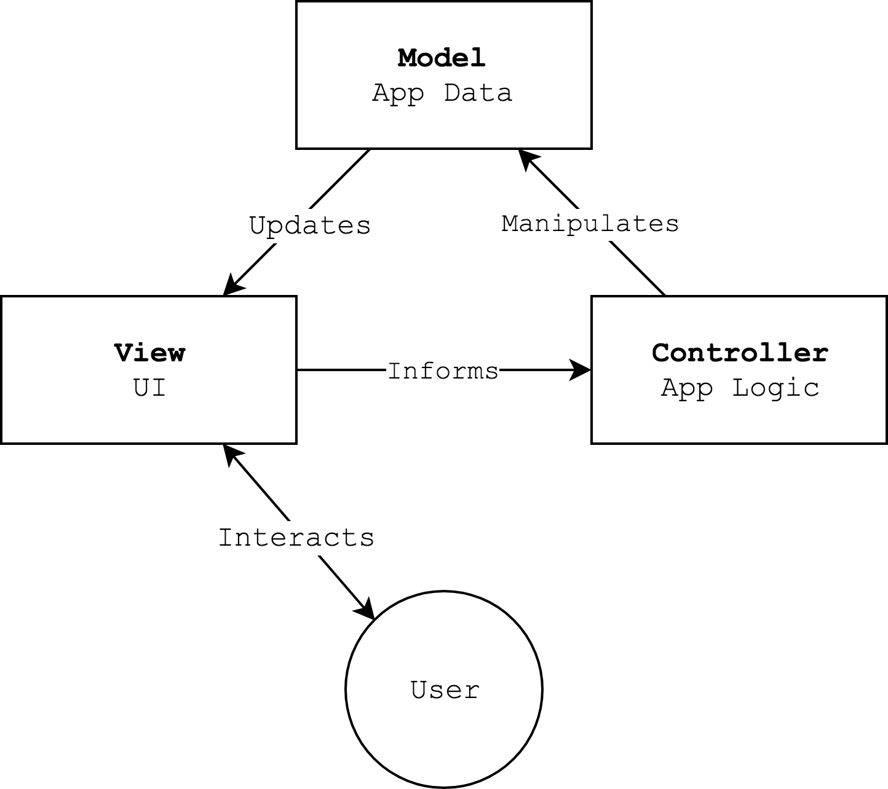

## Intro to HTML DOM API

| HTML 			| CSS 					| Javascript    |
| --- 			| ---					| ---           |
| Content		| Style					| Behavior      |
| What it says	| What it looks like 	| What it does  |

## Background

### Data Models

When creating a computer program it is important to carefully consider both what the program should do and how the program should structure it's data. 

The complexity of an algorithm needed to accomplish a task can vary greatly based on how the data is structured.


| What to Do (Algorithm) | What to Know (Data)      |
| ---------------------- | ------------------------ |
| operators              | literals                 |
| expressions            | variables                |
| statements             | indexed arrays (lists)   |
| control flow           | associative array (maps) |
| functions              | &nbsp;                   |

| What to Do  + What to Know |
| --- |
| Objects |

In the real world, many entities require multiple values to be described. A rectangle can be described by its position and dimensions: `x`, `y`, `width`, `height`. Entities may also have related actions, like `draw()`.

Javascript provides Objects to represent the data and actions related to an entity. Some programming languages have syntax for describing just an entity's data. These are often called *records* or *structures*. Since Javascript doesn't have structures, objects are used instead. When an object contains just data members, and no actions it might be called a *plain old data object*.

In Javascript the values in an array or object can be mixed types. They can be primitive values like numbers or strings, objects, or arrays. By combining and nesting these types of data values, you can create complex data models.

``` javascript
sprite = { 
    name: "flappy",
    bounds: {x:10, y:10, width: 100, height: 100},
    speed: {x: 10, y: 0},
    currentFrame: 1,
    frames: ["flap_up.jpg", "flap_down.jpg"]
}
```


::: .callout
Activity: Model a System
/::


### Model View Controller

> Model View Controller is an architectural pattern for developing user interfaces.{bigger}

Wikipedia{attrib}

Model
: Represents the application data. This includes the specific values:

```
David, Anne, and Carrol exist. David's age is 3.
```

and the intended structure:

```
The application contains *people*. All *people* have an *age*. *Ages* can not be less than 0.
```


View
: The view displays the data to the user and accepts user input.

Controller
: The controller respons to user actions, updates the model, and coordinates the model and view.

[MVC Relationship Charts](https://www.google.com/search?q=model+view+controller&safe=off&source=lnms&tbm=isch&sa=X&ved=0ahUKEwiUyd-6_uzdAhVjplkKHaL6C08Q_AUIDigB&biw=1094&bih=1070&dpr=2.5)




### MVC + The Browser

Model -> DOM{bigger}

View -> Web View{bigger}

Controller -> Javascript{bigger}


## What is in the DOM

[Example](../examples/dom)

The DOM is a *tree* of the elements in your document, their attributes, and their state.

::: .callout
Activity: Model a Webpage
/::

## Inspecting and Manipulating the DOM

The Chrome developer tools provide an inspector view for inspecting and editing the DOM. The console provides interactive inspection of DOM elements.

```
console.log("hello, world!");
fruit = "banana";
console.log(fruit);
fruit;

```

[Paul Irish: Become a Javascript Console Power-User](https://www.youtube.com/watch?v=4mf_yNLlgic)


## Manipulating the DOM w/ Javascript

You can use Javascript to manipulate the DOM. Your changes will be reflected on the rendered webpage. Note, that javascript isn't chaning the HTML source. The browser builds the DOM from the source, and then javascript changes the DOM. The source is untouched, and reloading the page will reset the DOM.

[MDN: DOM](https://developer.mozilla.org/en-US/docs/Web/API/Document_Object_Model)

## Interaction + Javascript

You can use Javascript to respond to user interactions. When the user clicks a button, chooses an item from a dropdown, or hovers over an image the webpage will emit *events*. These events can be *listened* for by your code. Your code can then respond any way it wishes, including by manipulating the DOM.
