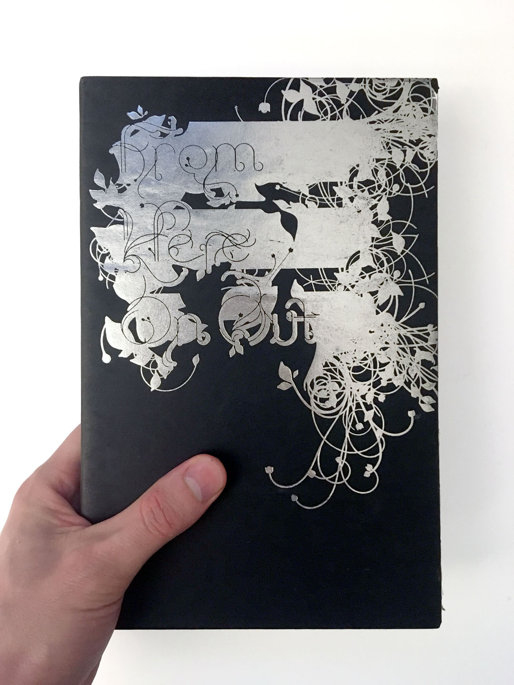
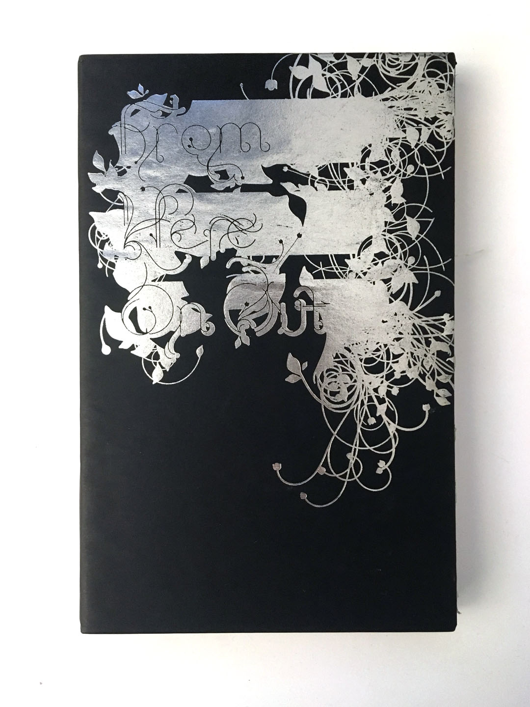
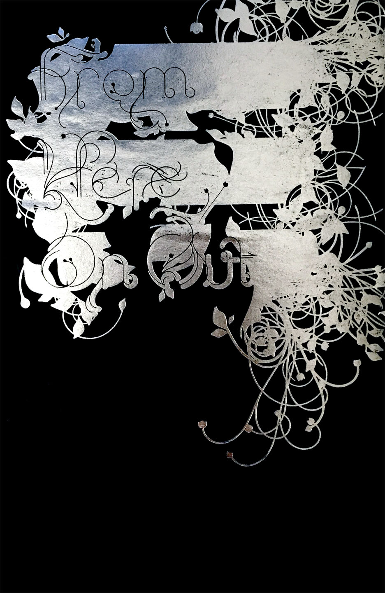

## September 18 {plain}

| Time  | ESA      | Type     | Activity                    |
| ----- | -------- | -------- | --------------------------- |
| 12:10 | Study    | Lecture  | Framing                     |
| 12:40 | Activate | Workshop | Documentation Photo Styling |

## Design Responsibility
Every design decision has an impact on the whole. Some decisions have a minor impact and some have a major impact, but the importance of a design decision does not depend on the effort spent by the designer in making it. It is easy to spend a great deal of time on an unimportant decision. It is easy overlook something critical, trusting to convention, defaults, or the status quo.

As a designer you can't avoid the impact of design decision by leaving it unmade.

You can't avoid communicating.

Each design decision *you make* communicates.

Each design decision *you don't make* communicates.

Watch out for defaults.

### Framing

[NYC Garbage](http://nycgarbage.com/)

[Fountain](https://www.tate.org.uk/art/artworks/duchamp-fountain-t07573)

### Documentation Photo Styling

### Technical

| Choice         | Options                                                                                                             |
| -------------- | ------------------------------------------------------------------------------------------------------------------- |
| Camera         | Phone, Point and Shoot, DSLR, Toy, Scanner, Screengrab                                                              |
| Lighting       | General Indoor, Flash, Studio Directional, Studio 3 Point, Window, Outdoor Overcast/Indirect, Outdoor Direct, Flash |
| Depth of Field | Deep, Shallow, Tilt-shift                                                                                           |

   

### Styling

Your photo-styling [choices matter](https://theblog.okcupid.com/dont-be-ugly-by-accident-b378f261dea4)

| Choice      | Options                                                                       |
| ----------- | ----------------------------------------------------------------------------- |
| FoV         | Tight, Middle, Wide                                                           |
| Environment | White wall, Seamless, Gallery, Pattern, Matted, Set, Workspace, Public spaces |
| People      | None, Hands, Faces, Groups, Kids                                              |
| Props       | None, Multiple of Subject, In-situ/In Device, Tools, Materials                |

### Post-Processing

| Choice    | Options                                |
| --------- | -------------------------------------- |
| Style     | Color Correct, Filter, Sharpen + Level |
| Crop      | Full Frame, Crop                       |
| Scale     | High Res, Low Res, Pixelate            |
| Thumbnail | Custom, Auto, Same                     |
| Naming    | Clear                                  |

## Workshop: Documentation Photos 

### Groups

Rift
: Josefina + Alyssa + Julia + Brooke

Sketch
: Lizette + Lillian + Dahee + Forrest

Site
: Keaton + Ola + Herbert + Andy + Rui

### Brainstorm and Plan
*Groups, 20 minutes*

| Style Direction | Description                                                            |
| --------------- | ---------------------------------------------------------------------- |
| High-End        | Make it look like its gonna cost you.                                  |
| Experimental    | Make it look like cutting edge research fresh from the lab.            |
| Work-in-Process | Make it look like a behind-the-scenes peek into your practice.         |
| Friendly        | Make it look affordable, approachable, fun                             |
| Professional    | Make it looks like you got paid to do it.                              |
| Clean           | Make it look clear, legible, and free of distraction.                  |
| Candid          | Make it look like you didn't out thought into it, even though you did. |
| Finished        | Make it look like complete and ready to go.                            |
| Funny           | Make it look like it doesn't take itself too seriously.                |
| Active          | Make it look like it exists and is in use.                             |
| Forensic        | Make it look like evidence in a trial.                                 |

1. Choose 4 style directions from the list above, select for variety.
2. Discuss how to achieve each selected style with your artifact. 
3. Create a typed, clear list of design choices for each style. Email to your group and cc me.

### Photograph
*Individual, 1 hour*

1. I'll assign you three style directions. DO NOT SHARE YOUR STYLE DIRECTION!
2. Photograph of your artifact in each style.
3. Scale your photo to 1920 wide, name it like this: `lastname_1.jpg`.
4. Put it in the [google folder](https://drive.google.com/drive/folders/1D90C_7C5ISNFO7l-VriV8kh4VbxGRlJK?usp=sharing).
5. If you leave, be back BEFORE 2:10 pm.

### Share + Discuss
*Class, 40 minutes*

<!-- poster -- 
object (gadget) -- Arduino
website -- NYTimes
clothing (wearable gadget) --
logo
sketches in a sketchbook -->

